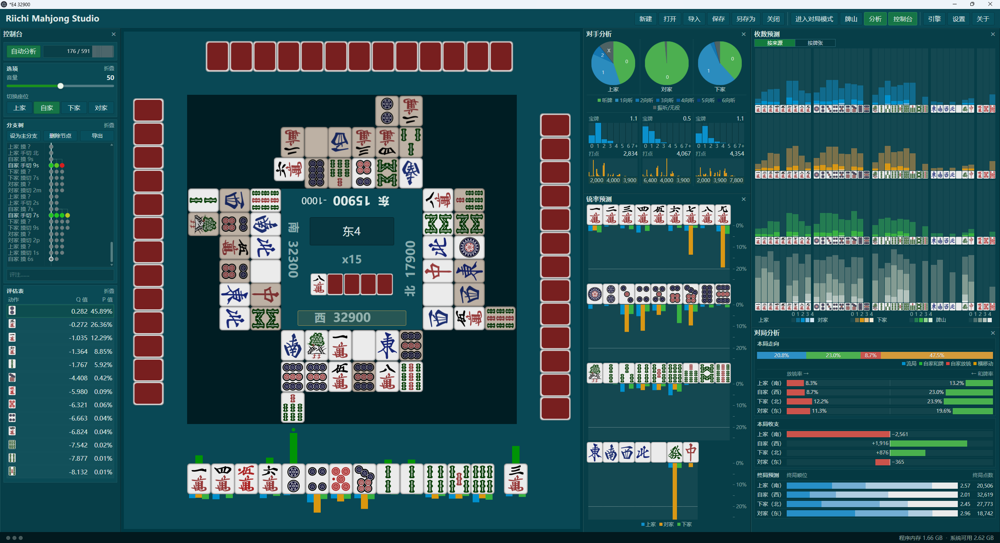

### [中文](#%E4%B8%AD%E6%96%87) | [日本語](#%E6%97%A5%E6%9C%AC%E8%AA%9E) | [English](#english)

---

## 中文

### 立直麻将研究室

一款用于立直麻将牌谱研究和对局练习的桌面程序，可加载兼容 [riichi-engine-protocol](https://github.com/SiyeW/riichi-engine-protocol) 协议的外部引擎。

### 主要功能

- 可以在对局模式中与引擎练习，实时获取引擎指导
- 可以在研究模式中回看牌局、建立分支并记录评注
- 可以导入 [Mortal 在线分析](https://mjai.ekyu.moe/zh-cn.html)报告和[天凤自定义牌谱](https://tenhou.net/6/)
- 可以打开和保存 `.mjstudio` 存档，与他人分享牌局
- 可以自由安装外部引擎，分析决策、对手向听、牌张放铳率等信息
- 可以自由安装外部音效包
- 界面支持简体中文、日文和英文

### 获取与启动

前往 [Releases](https://github.com/SiyeW/riichi-mahjong-studio/releases) 下载最新的预览版，解压后运行 `Riichi Mahjong Studio.exe`。

### 基本使用

- **新建牌局：** 点击“新建”，从一副随机生成的完整牌山开始练习。对局中的其他玩家由引擎控制。
- **打开存档：** 点击“打开”，选择此前保存的 `.mjstudio` 文件。旧 `.mjtrain` 存档也可以打开。
- **导入牌谱：** 点击“导入”，粘贴 [Mortal 在线分析](https://mjai.ekyu.moe/zh-cn.html)报告地址，或[天凤自定义牌谱](https://tenhou.net/6/)的地址或内容。导入后可以随机重建未知牌山并进入对局模式。
- **研究牌局：** 在研究模式中在牌局分支、节点间跳转，也可以为节点添加评注。
- **保存存档：** 使用“保存”或“另存为”将当前牌局及其分支写入 `.mjstudio` 存档。

### 外部引擎与音效

#### 配置引擎

浏览和整理牌谱不需要安装引擎。对局练习、决策分析等功能需要配置拥有相应能力的引擎及其权重文件。

1. 准备兼容 [riichi-engine-protocol](https://github.com/SiyeW/riichi-engine-protocol) 协议的引擎程序及其所需的模型权重。
2. 打开“引擎”，点击“添加引擎”，选择引擎的可执行文件或 Python 入口。
3. 等待主程序读取引擎声明，然后选择由该引擎提供的输出。一个引擎可以承担多种输出。
4. 按界面提示选择模型权重、运行设备并调整引擎参数。
5. 点击“加载”。引擎加载后，其输出便可用于相应的分析界面或对局流程。
6. 需要修改已经加载的引擎时，请先将其卸载。

#### 配置音效

将兼容的音效包完整解压到主程序旁的 `sound-packs` 目录（没有该目录时可自行新建），重新启动程序，然后在“设置 → 音效 → 音效包”中选择。

### 开发

目前仍处于开发阶段，功能尚未完备，界面和操作仍可能调整。未来将开发跨平台版本。

欢迎试用、提交 [Issue](https://github.com/SiyeW/riichi-mahjong-studio/issues) 或参与开发。主程序的构建、调试和测试方法请见 [开发文档](docs/development.md)。第三方引擎协议请见 [riichi-engine-protocol](https://github.com/SiyeW/riichi-engine-protocol)，自定义音效包的制作方法请见 [音效包文档](docs/sound-packs.md)。更多问题欢迎联系。

### 相关项目

- [riichi-engine-protocol](https://github.com/SiyeW/riichi-engine-protocol)：引擎通信协议和程序包格式
- [riichi-opponent-analysis](https://github.com/SiyeW/riichi-opponent-analysis)：一款与本程序兼容的对手分析引擎，提供对手向听预测和牌张铳率预测的输出。训练完成的模型权重将在相关权利和许可证全部确认后提供

---

## 日本語

### Riichi Mahjong Studio

リーチ麻雀の牌譜検討と対局練習に使えるデスクトップアプリケーションで、[riichi-engine-protocol](https://github.com/SiyeW/riichi-engine-protocol) に対応する外部エンジンを読み込めます。

### 主な機能

- 対局モードでエンジンを相手に練習し、リアルタイムで助言を受けられます
- 検討モードで対局を振り返り、分岐を作成してコメントを記録できます
- [Mortal オンライン解析](https://mjai.ekyu.moe/zh-cn.html)レポートと[天鳳カスタム牌譜](https://tenhou.net/6/)をインポートできます
- `.mjstudio` 形式の牌譜を開いて保存し、他の人と対局を共有できます
- 外部エンジンを自由に導入し、行動選択、対戦相手のシャンテン状態、各牌の放銃率などを解析できます
- 外部効果音パックを自由に導入できます
- 中国語（簡体字）、日本語、英語で表示できます

### 入手と起動

[Releases](https://github.com/SiyeW/riichi-mahjong-studio/releases) から最新のプレビュー版をダウンロードし、展開後に `Riichi Mahjong Studio.exe` を起動します。

### 基本的な使い方

- **新しい対局：** 「新規」をクリックすると、ランダムに生成された完全な牌山から練習を始めます。他のプレイヤーはエンジンが操作します。
- **牌譜を開く：** 「開く」をクリックし、保存済みの `.mjstudio` ファイルを選択します。旧 `.mjtrain` 形式のファイルも開けます。
- **牌譜をインポート：** 「インポート」をクリックし、[Mortal オンライン解析](https://mjai.ekyu.moe/zh-cn.html)レポートの URL、または[天鳳カスタム牌譜](https://tenhou.net/6/)の URL や内容を貼り付けます。インポート後は、未確定部分の牌山をランダムに再構築して対局モードへ移ることもできます。
- **牌譜を検討：** 検討モードでは対局の分岐やノードを行き来し、ノードにコメントを付けることもできます。
- **牌譜を保存：** 「保存」または「名前を付けて保存」を使用し、現在の対局と分岐を `.mjstudio` 形式で保存します。

### 外部エンジンと効果音

#### エンジンの設定

牌譜の閲覧と整理にはエンジンを必要としません。対局練習や打牌解析などの機能には、必要な能力を持つエンジンとその重みファイルを設定してください。

1. [riichi-engine-protocol](https://github.com/SiyeW/riichi-engine-protocol) に対応するエンジンプログラムと、必要なモデルの重みを用意します。
2. 「エンジン」を開き、「エンジンを追加」をクリックして、実行ファイルまたは Python エントリーポイントを選択します。
3. エンジン情報の読み込み後、そのエンジンに割り当てる出力を選択します。1 つのエンジンに複数の出力を割り当てることもできます。
4. 画面の指示に従ってモデルの重み、実行デバイス、エンジン固有の設定を指定します。
5. 「読み込む」をクリックします。読み込みが完了すると、対応する解析画面や対局処理で出力が使用されます。
6. 読み込み済みのエンジンを変更する場合は、先に読み込みを解除してください。

#### 効果音の設定

対応する効果音パックを、アプリケーションと同じ場所にある `sound-packs` フォルダーへ構成を保ったまま展開します。フォルダーがない場合は作成してください。アプリケーションを再起動し、「設定 → サウンド → 効果音パック」から選択します。

### 開発

現在も開発段階にあり、未完成の機能があります。画面や操作も今後変更される可能性があります。クロスプラットフォーム版も開発する予定です。

ぜひお試しいただき、[Issue](https://github.com/SiyeW/riichi-mahjong-studio/issues) の投稿や開発への参加もご検討ください。アプリケーション本体のビルド、デバッグ、テストについては [開発者向けドキュメント](docs/development.md) を参照してください。サードパーティー製エンジンのプロトコルについては [riichi-engine-protocol](https://github.com/SiyeW/riichi-engine-protocol)、カスタム効果音パックの制作方法については [効果音パックのドキュメント](docs/sound-packs.md) を参照してください。ご不明な点があれば、お気軽にお問い合わせください。

### 関連プロジェクト

- [riichi-engine-protocol](https://github.com/SiyeW/riichi-engine-protocol)：エンジン通信プロトコルとパッケージ形式
- [riichi-opponent-analysis](https://github.com/SiyeW/riichi-opponent-analysis)：本アプリケーションと互換性のある対戦相手解析エンジンで、対戦相手のシャンテン予測と牌ごとの放銃率予測を出力します。学習済みのモデルの重みは、関連する権利とライセンスをすべて確認した後に提供する予定です

---

## English

### Riichi Mahjong Studio

A desktop application for studying game records and practicing Riichi Mahjong. It can load external engines compatible with [riichi-engine-protocol](https://github.com/SiyeW/riichi-engine-protocol).

### Main features

- Practice against engines in play mode with real-time guidance
- Review games, create branches, and record comments in research mode
- Import [Mortal online analysis](https://mjai.ekyu.moe/zh-cn.html) reports and [Tenhou custom game records](https://tenhou.net/6/)
- Open and save `.mjstudio` records to share games with others
- Install external engines of your choice to analyze decisions, opponent shanten, tile-specific deal-in probability, and more
- Install external sound packs of your choice
- Use the interface in Simplified Chinese, Japanese, or English

### Download and launch

Visit [Releases](https://github.com/SiyeW/riichi-mahjong-studio/releases) to download the latest preview build, extract it, and run `Riichi Mahjong Studio.exe`.

### Basic use

- **Create a game:** Select “New” to start from a randomly generated complete wall. The other players are controlled by engines.
- **Open a record:** Select “Open” and choose a saved `.mjstudio` file. Legacy `.mjtrain` records are also supported.
- **Import a record:** Select “Import” and paste a [Mortal online analysis](https://mjai.ekyu.moe/zh-cn.html) report URL or the URL or content of a [Tenhou custom game record](https://tenhou.net/6/). After importing, the unknown wall can be reconstructed at random so that the game can be continued in play mode.
- **Study a game:** In research mode, move between game branches and nodes, and add comments to individual nodes.
- **Save a record:** Use “Save” or “Save as” to write the current game and its branches to a `.mjstudio` record.

### External engines and sound

#### Configure an engine

No engine is required to browse and organize game records. Practice games, decision analysis, and similar features require an engine with the corresponding capabilities and its weight files.

1. Prepare an engine compatible with [riichi-engine-protocol](https://github.com/SiyeW/riichi-engine-protocol) and any model weights it requires.
2. Open “Engine,” select “Add engine,” and choose the engine executable or Python entry point.
3. Wait for the application to read the engine declaration, then select the outputs that the engine should provide. One engine may provide multiple outputs.
4. Select the requested model weights and runtime device, and adjust any engine-specific options.
5. Select “Load.” Once loaded, the engine output is available to the corresponding analysis view or game process.
6. Unload a running engine before changing its configuration.

#### Configure sound

Extract a compatible sound pack, without changing its internal structure, into the `sound-packs` directory beside the application. Create the directory if it does not exist. Restart the application, then select the pack under “Settings → Sound → Sound pack.”

### Development

The project is still under development. Some features are incomplete, and the interface and workflows may change. Cross-platform versions are planned.

You are welcome to try the application, submit an [issue](https://github.com/SiyeW/riichi-mahjong-studio/issues), or contribute to its development. For instructions on building, debugging, and testing the main application, see the [development documentation](docs/development.md). For the third-party engine protocol, see [riichi-engine-protocol](https://github.com/SiyeW/riichi-engine-protocol). For instructions on creating custom sound packs, see the [sound pack documentation](docs/sound-packs.md). Questions are welcome.

### Related projects

- [riichi-engine-protocol](https://github.com/SiyeW/riichi-engine-protocol): engine communication protocol and package format
- [riichi-opponent-analysis](https://github.com/SiyeW/riichi-opponent-analysis): an opponent-analysis engine compatible with this application, providing opponent shanten predictions and tile-specific deal-in probability predictions; trained model weights will be provided after all related rights and licenses have been confirmed

