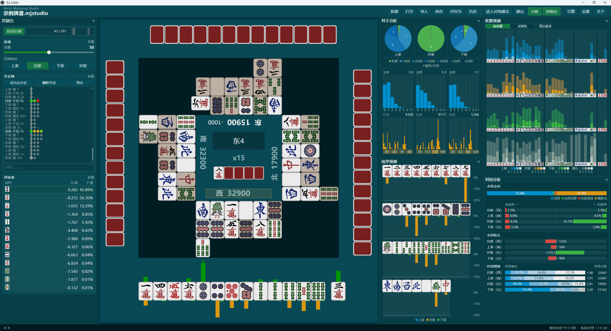
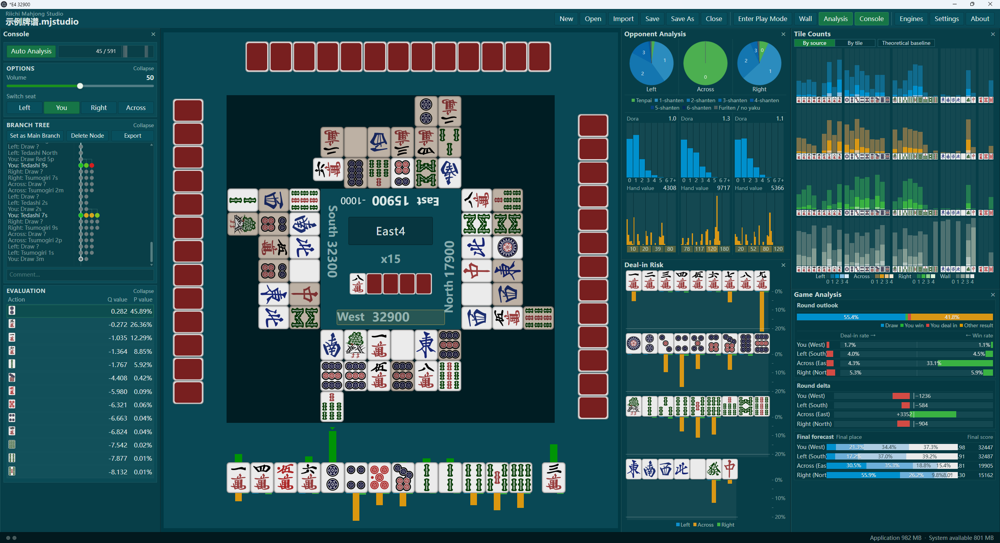

# Riichi Mahjong Studio

### [中文](#中文) | [日本語](#日本語) | [English](#english)

---

## 中文

### 立直麻将研究室

一款用于立直麻将牌谱研究和对局练习的桌面程序，可加载兼容 [Riichi Engine Protocol](https://github.com/SiyeW/riichi-engine-protocol) 的外部引擎。

### 主要功能

* 在研究模式中回看牌局、建立分支，并为各个节点记录评注
* 在对局模式中从完整牌山开始练习，其他玩家由引擎控制
* 通过 Riichi Engine Protocol 安装外部引擎，不同分析项目可以使用不同引擎
* 根据已加载引擎的能力显示动作推荐、对手向听、放铳风险、暗牌和牌山预测、打点与结果预测等信息
* 导入 [Mortal 在线分析](https://mjai.ekyu.moe/zh-cn.html)报告和[天凤自定义牌谱](https://tenhou.net/6/)
* 使用 `.mjstudio` 保存牌局、研究分支和评注，也可以与他人分享
* 支持自定义音效包
* 界面支持简体中文、日文和英文

### 分析信息

加载具有相应能力的外部引擎后，Studio 可以在牌局中显示以下类型的分析信息：

| 类别   | 信息                 |
| ---- | ------------------ |
| 动作分析 | 候选动作、推荐动作、动作评价     |
| 对手状态 | 三名对手的向听状态          |
| 放铳风险 | 各牌张对三名对手的放铳概率或风险   |
| 对手暗牌 | 对手手牌的预测分布          |
| 牌山   | 未见牌和剩余牌山的预测        |
| 手牌价值 | 对手宝牌数量、打点等估计       |
| 小局结果 | 和牌、放铳、流局等结果及分数变化预测 |
| 整场结果 | 最终顺位和终局分数预测        |

一个引擎可以提供多项输出，也可以为不同输出分别配置不同的引擎。

### 牌谱研究

研究模式以节点和分支保存牌局。

可以回到牌局中的任意节点建立新的分支，选择不同的动作并继续向后研究，也可以在各个节点之间切换。节点可以添加评注，用来记录当时的判断、不同选择的比较或其他研究内容。

牌局及其分支、评注可以一起保存在 `.mjstudio` 文件中，之后继续编辑或分享给其他人。

### 对局练习

新建牌局时，程序会随机生成一副完整牌山，并由引擎控制其他三名玩家。

对局过程中可以使用已经配置的外部引擎获取相应的分析信息。

从导入牌谱进入对局模式时，也可以重新构建牌谱中未知的牌山部分，从已有局面继续尝试不同的后续选择。

### 导入牌谱

目前支持导入：

* [Mortal 在线分析](https://mjai.ekyu.moe/zh-cn.html)报告
* [天凤自定义牌谱](https://tenhou.net/6/)的地址或内容

导入后可以直接查看牌局，也可以添加评注、建立研究分支，或从其中的局面进入对局模式继续练习。

### 获取与启动

前往 [Releases](https://github.com/SiyeW/riichi-mahjong-studio/releases) 下载最新版本，解压后运行 `Riichi Mahjong Studio.exe`。

当前发布版本提供 Windows x64 便携版。

### 基本使用

* **新建牌局：** 点击“新建”，从随机生成的完整牌山开始练习。
* **打开存档：** 点击“打开”，选择此前保存的 `.mjstudio` 文件。旧 `.mjtrain` 存档也可以打开。
* **导入牌谱：** 点击“导入”，粘贴 Mortal 在线分析报告地址，或天凤自定义牌谱的地址或内容。
* **研究牌局：** 在研究模式中浏览牌局、建立分支、切换节点并添加评注。
* **保存存档：** 使用“保存”或“另存为”保存当前牌局及其研究内容。

### 外部引擎

Studio 通过 [Riichi Engine Protocol](https://github.com/SiyeW/riichi-engine-protocol) 与外部引擎通信。

外部引擎会声明自己提供的输出类型。一个引擎可以同时提供多项输出，也可以分别为动作分析、对手分析等功能配置不同引擎。

牌谱浏览、分支和评注等功能由主程序直接提供。对局中的其他玩家控制，以及动作推荐、对手分析等模型功能，需要加载具有相应能力的引擎。

#### 配置引擎

1. 准备兼容 Riichi Engine Protocol 的引擎程序及其所需模型权重。
2. 打开“引擎”，点击“添加引擎”，选择引擎的可执行文件或 Python 入口。
3. 等待主程序读取引擎声明，然后选择需要使用的输出。
4. 按界面提示选择模型权重、运行设备并调整引擎参数。
5. 点击“加载”。加载完成后，相应输出即可用于分析界面或对局流程。
6. 需要修改已加载引擎的配置时，请先将其卸载。

### 音效包

将兼容的音效包完整解压到主程序旁的 `sound-packs` 目录中；如果没有该目录，可以自行创建。

重新启动程序后，在“设置 → 音效 → 音效包”中选择需要使用的音效包。

自定义音效包的制作方法见[音效包文档](docs/sound-packs.md)。

### 相关项目

* [Riichi Engine Protocol](https://github.com/SiyeW/riichi-engine-protocol)：Studio 与外部引擎之间使用的通信协议和程序包格式。
* [Riichi Analysis Engine](https://github.com/SiyeW/riichi-analysis-engine)：正在开发中的立直麻将分析引擎，覆盖动作推荐、对手状态、隐藏信息和牌局结果等分析任务。

### 开发与贡献

欢迎提交 [Issue](https://github.com/SiyeW/riichi-mahjong-studio/issues)、参与讨论或贡献代码。

主程序的构建、调试和测试方法见[开发文档](docs/development.md)。

外部引擎的接口和程序包格式见 [Riichi Engine Protocol](https://github.com/SiyeW/riichi-engine-protocol)。

### 许可证

主程序采用 [Apache License 2.0](LICENSE)。

第三方代码、素材和外部组件适用各自的许可条款，详见[第三方声明](THIRD_PARTY_NOTICES.md)。

---

## 日本語

### 立直麻雀スタジオ

リーチ麻雀の牌譜検討と対局練習を行うためのデスクトップアプリケーションです。[Riichi Engine Protocol](https://github.com/SiyeW/riichi-engine-protocol) に対応した外部エンジンを読み込めます。

### 主な機能

* 研究モードで牌譜を確認し、分岐を作成して各ノードにコメントを記録
* 対局モードで完全な牌山から練習し、他家はエンジンが操作
* Riichi Engine Protocol を通じて外部エンジンを追加し、解析項目ごとに異なるエンジンを使用可能
* 読み込んだエンジンの機能に応じて、推奨行動、相手のシャンテン数、放銃リスク、手牌や牌山の予測、打点、対局結果などを表示
* [Mortal Online Analysis](https://mjai.ekyu.moe/ja.html) のレポートと[天鳳カスタム牌譜](https://tenhou.net/6/)をインポート
* `.mjstudio` ファイルに牌譜、研究分岐、コメントを保存し、他のユーザーと共有
* カスタムサウンドパックに対応
* 簡体字中国語、日本語、英語のUIに対応

### 解析情報

対応する機能を持つ外部エンジンを読み込むと、Studio では以下のような解析情報を表示できます。

| 分類    | 情報                             |
| ----- | ------------------------------ |
| 行動解析  | 候補行動、推奨行動、行動評価                 |
| 相手状態  | 3人の相手のシャンテン状態                  |
| 放銃リスク | 各牌について、3人の相手それぞれに対する放銃確率またはリスク |
| 相手手牌  | 相手手牌の予測分布                      |
| 牌山    | 未知牌と残りの牌山の予測                   |
| 手牌価値  | 相手のドラ枚数、打点などの推定                |
| 局結果   | 和了、放銃、流局などの結果と得失点の予測           |
| 半荘結果  | 最終順位と最終持ち点の予測                  |

1つのエンジンから複数の出力を利用することも、出力ごとに別のエンジンを設定することもできます。

### 牌譜研究

研究モードでは、牌局をノードと分岐として保存します。

任意のノードに戻って新しい分岐を作り、別の行動を選んでその先を検討できます。ノード間は自由に移動でき、各ノードにはその時点での判断や選択肢の比較などをコメントとして記録できます。

牌局、分岐、コメントはまとめて `.mjstudio` ファイルに保存でき、後から続きを編集したり他のユーザーと共有したりできます。

### 対局練習

新しい対局を作成すると、プログラムが完全な牌山をランダムに生成し、他の3人をエンジンが操作します。

対局中は、設定済みの外部エンジンから対応する解析情報を取得できます。

インポートした牌譜から対局モードへ移る場合は、牌譜からは分からない牌山部分を再構成し、既存の局面から別の展開を試すこともできます。

### 牌譜のインポート

現在、以下のデータをインポートできます。

* [Mortal Online Analysis](https://mjai.ekyu.moe/ja.html) のレポート
* [天鳳カスタム牌譜](https://tenhou.net/6/) のURLまたは内容

インポート後は牌譜を閲覧できるほか、コメントの追加、研究分岐の作成、局面から対局モードへ移っての練習もできます。

### 入手と起動

[Releases](https://github.com/SiyeW/riichi-mahjong-studio/releases) から最新版をダウンロードし、展開後に `Riichi Mahjong Studio.exe` を実行してください。

現在は Windows x64 向けのポータブル版を配布しています。

### 基本操作

* **新しい対局：** 「新規」をクリックし、ランダムに生成された完全な牌山から練習を開始します。
* **保存データを開く：** 「開く」をクリックし、保存済みの `.mjstudio` ファイルを選択します。旧 `.mjtrain` ファイルも開けます。
* **牌譜をインポート：** 「インポート」をクリックし、Mortal Online Analysis のレポートURL、または天鳳カスタム牌譜のURLや内容を入力します。
* **牌譜を研究：** 研究モードで牌局を確認し、分岐の作成、ノードの切り替え、コメントの追加を行います。
* **保存：** 「保存」または「名前を付けて保存」で、現在の牌局と研究内容を保存します。

### 外部エンジン

Studio は [Riichi Engine Protocol](https://github.com/SiyeW/riichi-engine-protocol) を通じて外部エンジンと通信します。

外部エンジンは、自身が提供する出力の種類を宣言します。1つのエンジンで複数の出力を提供することも、行動解析や相手解析などに別々のエンジンを設定することもできます。

牌譜の閲覧、分岐、コメントなどはStudio本体の機能です。他家の操作や、推奨行動、相手解析などのモデル機能には、対応する外部エンジンが必要です。

#### エンジンの設定

1. Riichi Engine Protocol に対応したエンジンプログラムと、必要なモデル重みを用意します。
2. 「エンジン」を開き、「エンジンを追加」をクリックして、エンジンの実行ファイルまたは Python エントリを選択します。
3. Studio がエンジン宣言を読み込んだ後、使用する出力を選択します。
4. 画面の案内に従って、モデル重み、実行デバイス、エンジンのパラメータを設定します。
5. 「読み込み」をクリックします。読み込みが完了すると、対応する出力を解析画面や対局で使用できます。
6. 読み込み済みのエンジン設定を変更する場合は、先にアンロードしてください。

### サウンドパック

対応するサウンドパックを、プログラム本体と同じ場所にある `sound-packs` ディレクトリへ展開します。ディレクトリがない場合は作成してください。

プログラムを再起動し、「設定 → サウンド → サウンドパック」から使用するサウンドパックを選択します。

カスタムサウンドパックの作成方法は[サウンドパックのドキュメント](docs/sound-packs.md)を参照してください。

### 関連プロジェクト

* [Riichi Engine Protocol](https://github.com/SiyeW/riichi-engine-protocol)：Studio と外部エンジンの間で使用する通信プロトコルとパッケージ形式。
* [Riichi Analysis Engine](https://github.com/SiyeW/riichi-analysis-engine)：現在開発中のリーチ麻雀解析エンジン。行動推薦、相手状態、非公開情報、対局結果などの解析タスクを扱います。

### 開発とコントリビュート

[Issue](https://github.com/SiyeW/riichi-mahjong-studio/issues) の投稿、議論、コードへのコントリビュートを歓迎します。

ビルド、デバッグ、テストについては[開発ドキュメント](docs/development.md)を参照してください。

外部エンジンのインターフェースとパッケージ形式については [Riichi Engine Protocol](https://github.com/SiyeW/riichi-engine-protocol) を参照してください。

### ライセンス

本体は [Apache License 2.0](LICENSE) で提供しています。

サードパーティーのコード、素材、外部コンポーネントには、それぞれのライセンスが適用されます。詳細は[サードパーティーに関する表記](THIRD_PARTY_NOTICES.md)を参照してください。

---

## English

### Riichi Mahjong Studio

A desktop application for Riichi Mahjong game-record study and game practice. It can load external engines compatible with the [Riichi Engine Protocol](https://github.com/SiyeW/riichi-engine-protocol).

### Main Features

* Review games in Study Mode, create branches, and add annotations to individual nodes
* Practice from a complete wall in Game Mode, with the other players controlled by engines
* Install external engines through the Riichi Engine Protocol and use different engines for different analysis outputs
* Display action recommendations, opponent shanten, deal-in risk, concealed-hand and wall predictions, hand value, and outcome predictions according to the capabilities of the loaded engines
* Import [Mortal Online Analysis](https://mjai.ekyu.moe/en.html) reports and [Tenhou custom game records](https://tenhou.net/6/)
* Save games, study branches, and annotations in `.mjstudio` files and share them with others
* Use custom sound packs
* Use the interface in Simplified Chinese, Japanese, or English

### Analysis Information

After loading an external engine with the corresponding capabilities, Studio can display the following types of analysis:

| Category        | Information                                                             |
| --------------- | ----------------------------------------------------------------------- |
| Action analysis | Candidate actions, recommended actions, action evaluation               |
| Opponent state  | Shanten states of the three opponents                                   |
| Deal-in risk    | Deal-in probability or risk for each tile against each opponent         |
| Opponent hands  | Predicted distributions of opponents' concealed hands                   |
| Wall            | Predictions for unseen tiles and the remaining wall                     |
| Hand value      | Estimates of opponents' dora count, hand value, and related information |
| Kyoku result    | Predictions for wins, deal-ins, draws, and score changes                |
| Match result    | Predicted final placement and final scores                              |

A single engine can provide several outputs, or different engines can be assigned to different outputs.

### Game Record Study

Study Mode stores the game as nodes and branches.

You can return to any node, create a new branch, choose a different action, and continue studying from there. You can move between nodes freely. Each node can also contain annotations for recording decisions, comparing alternatives, or keeping other notes.

The game, its branches, and annotations can be saved together in a `.mjstudio` file for later editing or sharing.

### Game Practice

When creating a new game, the program generates a complete wall at random and lets engines control the other three players.

Configured external engines can provide their analysis outputs during the game.

When entering Game Mode from an imported record, Studio can also reconstruct the unknown part of the wall and continue from an existing position to try a different continuation.

### Importing Game Records

Studio currently supports:

* [Mortal Online Analysis](https://mjai.ekyu.moe/en.html) reports
* [Tenhou custom game records](https://tenhou.net/6/) by URL or content

After importing a game, you can review it directly, add annotations, create study branches, or enter Game Mode from one of its positions.

### Download and Launch

Go to [Releases](https://github.com/SiyeW/riichi-mahjong-studio/releases), download the latest version, extract it, and run `Riichi Mahjong Studio.exe`.

The current release is available as a portable build for Windows x64.

### Basic Usage

* **New Game:** Click “New” to start practicing from a randomly generated complete wall.
* **Open:** Click “Open” and select a previously saved `.mjstudio` file. Legacy `.mjtrain` files are also supported.
* **Import:** Click “Import” and enter a Mortal Online Analysis report URL or a Tenhou custom game-record URL or its contents.
* **Study:** Use Study Mode to review the game, create branches, switch between nodes, and add annotations.
* **Save:** Use “Save” or “Save As” to save the current game and study content.

### External Engines

Studio communicates with external engines through the [Riichi Engine Protocol](https://github.com/SiyeW/riichi-engine-protocol).

Each external engine declares the types of outputs it provides. One engine may provide several outputs, or separate engines can be configured for action analysis, opponent analysis, and other functions.

Game-record browsing, branches, and annotations are provided by Studio itself. Engine-controlled opponents and model-based functions such as action recommendations and opponent analysis require an engine with the corresponding capabilities.

#### Configuring an Engine

1. Prepare an engine compatible with the Riichi Engine Protocol and any model weights it requires.
2. Open “Engines”, click “Add Engine”, and select the engine executable or Python entry point.
3. Wait for Studio to read the engine declaration, then select the outputs you want to use.
4. Follow the interface to choose model weights, the runtime device, and engine parameters.
5. Click “Load”. Once loading is complete, the selected outputs can be used in the corresponding analysis views or game flow.
6. Unload an engine before changing its configuration.

### Sound Packs

Extract a compatible sound pack into the `sound-packs` directory next to the program. Create the directory if it does not exist.

Restart the program, then select the sound pack under “Settings → Sound → Sound Pack”.

See the [sound-pack documentation](docs/sound-packs.md) for instructions on creating custom sound packs.

### Related Projects

* [Riichi Engine Protocol](https://github.com/SiyeW/riichi-engine-protocol): The communication protocol and package format used between Studio and external engines.
* [Riichi Analysis Engine](https://github.com/SiyeW/riichi-analysis-engine): A Riichi Mahjong analysis engine currently under development, covering action recommendations, opponent state, hidden information, and game-outcome analysis.

### Development and Contribution

Issues, discussion, and code contributions are welcome.

See the [development documentation](docs/development.md) for build, debugging, and testing instructions.

See the [Riichi Engine Protocol](https://github.com/SiyeW/riichi-engine-protocol) for the external-engine interface and package format.

### License

The main application is licensed under the [Apache License 2.0](LICENSE).

Third-party code, assets, and external components are subject to their respective licenses. See [THIRD_PARTY_NOTICES.md](THIRD_PARTY_NOTICES.md) for details.

